# Agile Jira Management Course

Welcome to the Agile Jira Management knowledge article for Arcus! This course was designed as an entry-level guide for managing agile projects within Jira. This article assumes that you are familiar with standard Agile practices, and focuses more on Jira functionalities which support Agile development. For any assistance with Agile methodology, visit APM's [Agile Methodology Overview](https://wiki.chop.edu/display/ARCUS/Agile+Methodology+Overview) article.

## Terms & Acronyms

The following table provides a comprenhensive list of terms which may be useful for reference throughout this course:

 

| Term | Description |
|:-|-|
|**Affects Version(s)**| A Jira issue data field describing the version in which a Jira issue was discovered and logged.|
|**APM**| Arcus Project Management – the core team that provides both internal and external project management support and organization for the Arcus program. In the context of Arcus, internal projects relate to efforts owned by other core teams or Arcus leadership. External projects relate to customer-facing projects such as scientific projects.|
|**Epic**|A Jira issue type which describes a high-level project milestone or set of smaller efforts. User stories, tasks, and sub-tasks are linked to epics to distinguish task dependencies and definition of done for the epic.|
|**Fix Version(s)**|A Jira issue data field describing which version will be progressing as a result of issue completion.|
|**Issue**|A data object used in Jira to document and describe a task, milestone, or similar objective.|
|**Jira Project**|In the context of Jira, a project is the space in which versions, epics, and tasks are managed. For Agile Jira Management, the Jira project should be configured to a Software project.|
|**Project Backlog**|A list of outstanding tasks outside of the scope of the current sprint, all of which will eventually require execution for project completion.|
|**Sprint**|A segment of time within which an execution team completes a set of tasks that will progress an overall effort or project. Traditionally, sprints are 2 weeks in length (~ 10 business days, where the first day is focused on planning, the last day is focused on release and retrospective, and the median 8 days are focused on task execution).|
|**Sprint Goal(s)**|A description of the accomplishments with which the development team aims to achieve by releasing the sprint once completed.|
|**Sprint Backlog**|A list of outstanding tasks queued for the current sprint which have not yet been started. All tasks in the sprint backlog must have been scoped, defined, estimated.|
|**Sub-task**|A Jira issue type which describes the lowest-level of work needed to complete an effort, and is typically linked to a parent task or user story.|
|**Task**|A Jira issue type that describes work which requires completion to make progress on a project.|
|**Version/Release**|An organizational Jira feature which provides the ability to track total project progress, including insights into milestones and describing a high-level execution timeline of a project.|

## Agile Functionality in Jira

Before reviewing agile Jira management, it is first important to understand how Jira implements agile functionality. A **project** in the context of Jira is the space in which tasks and team projects will be managed and hosted within the Jira environment. Jira provides three forms of project spaces; business, software, and service projects. Software Jira projects provide functionality for managing agile projects within the Jira ecosystem. To begin managing an agile project in Jira, ensure that access to the desired Jira software project has been obtained, and that the Jira project has been configured to your team's preferences. Jira project configuration will include specification of desired issue types, workflows, fields, and other project-specific details which will determine the way in which the Jira project is used and managed. Jira project setup, however, is outside the scope of this document; for assistance with Jira project setup, contact the APM team.

Agile Jira management starts with creating, organizing, and maintaining a backlog of outstanding tasks which need to be completed to progress a project or similar effort. A **project backlog** is an outstanding list of tasks relating to a particular product or customer group. The backlog can contain various issue types such as user stories, tasks, and sub-tasks, but the Jira project's actual implementation will ultimately depend on your team's needs and requirements. Additionally, once the project backlog has been populated with issues, each issue should be categorized and linked into their appropriate versions and epics, which describes how each issue relates to a higher-level effort.

Once issues exist within the project backlog, a sprint can be created to begin scheduling the issues for execution. A **sprint** is a period of time within which an execution team commits to completing a set of tasks (traditionally, a sprint is 10 business days, where the first and last days are used for planning and releasing respectively, and the remaining 8 days are used for execution). In Jira, a sprint acts as a container for issues which the team will commit to executing during the sprint's lifecycle, and is described by a **sprint goal(s)** that states the objectives of the sprint and the value which the sprint will release the team's user-base. A Jira sprint is typically constructed during a team Sprint Planning ceremony. When the team's Release & Retrospective ceremony occurs, the Jira sprint is closed, resulting in the removal of all closed issues from the sprint backlog and the relocation of all remaining open issues in the sprint to the project backlog.

### Versions & Releases

A **version** in Jira is the highest-level organizational structure within a Jira project which groups associated issues relating to a common general effort. Versions are primarily used to track project progress and to manage project planning. In Agile Jira Management, versions typically describe a team project at its highest level, and can be used to group Jira issues that describe work which will progress a higher-level effort or project. Versions are managed within the *Releases* screen; to access *Releases*, navigate to the left-hand menu while within the targeted project and select the *Releases* button. The screenshot below demonstrates the *Releases* view within the Arcus Project Management (APM) Jira Project:

 

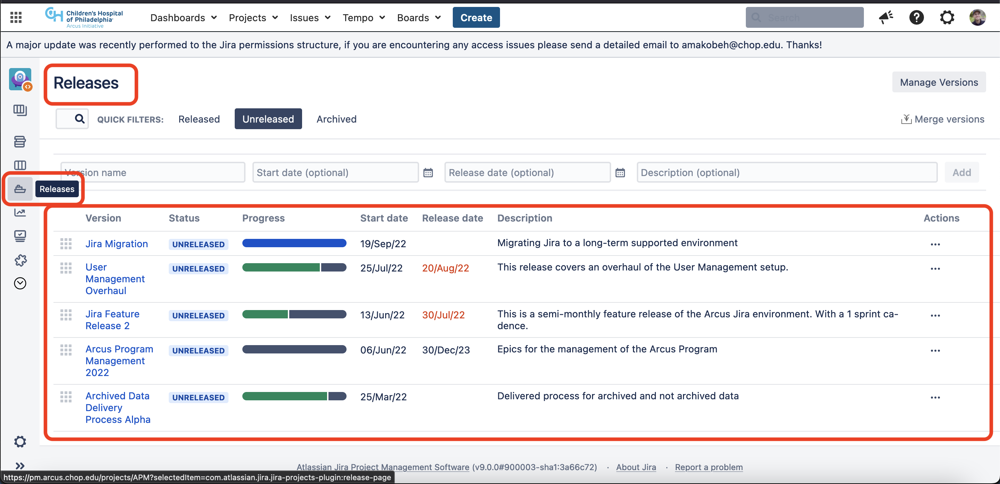

 

Observe the *Jira Migration* version in the screenshot above. The version title, *Jira Migration*, describes APM's effort of migrating from Jira Server to a more optimal Jira configuration. The *Status* field indicates the current state of the version, where "Unreleased" indicates that the version has not yet been released. The *Start date* and *Release date* fields should be set to the dates when progress starts and ends on a project respectively. The *Description* field provides space for management to elaborate with further context on the scope of the version.

A new release can be created by populating the text fields at the top of the Release view and pressing the *Add* button on the top-right side of the screen. A version can be released through several means once all tasks in its scope have been moved to a *Done* status. In the *Actions* menu, select the *Release* or *Build and Release* button and proceed with the following screens *(Note: the Build and Release option utilizes a tool called Bamboo for software development. In most cases, the Release option will suffice)*. A version can also be released by clicking on the version name and then clicking the *Release* button on the right side of the following page.

### Issue Types

An **issue** is a data object used in Jira to document to describe a task, milestone, or similar objective. Issues will have associated data fields that provide more information describing the task. For example, it is standard convention for the title of an issue to be a high-level summary of the work needing execution, while the issue description is often used to provide more detail and a definition of done (which benchmarks when the task has been completed). Another critical issue field is its status, which describes the current state of the ticket. Issues progress in their status according to the defined workflow for the Jira project; though statuses are customizable, a issue will generally have a status of **To Do** (denoted with grey), **In Progress** (denoted with blue), or **Done** (denoted in green). Jira supports a variety of issue types which serve specific purposes for categorizing and organizing incoming work.

#### Epics

An **epic** is a Jira issue which generally describes a larger effort task, a set of smaller tasks, or a milestone within a project, and requires a significant amount of work to complete (typically, but not always, more than a sprint's-worth of work). Consider an example project which will release  a new system to Arcus. Milestones may include project initialization & planning, requirements gathering and kickoff, building software infrastructure, developing the system, testing the system, and so on. These milestones in Jira can be represented using epics to provide detailed organization and managerial insight into their overall progress. Lower-level issue types (i.e: tasks, user stories, and sub-tasks) can be linked to epics and viewed in the backlog to provide further insight into remaining work left to reach a milestone. This functionality is particularly helpful for sprint planning, refinement, and monitoring project progress. It is important to note that epics are issues in Jira, and are categorized by similar issue fields as tasks, user stories, and sub-tasks (unlike versions).

 

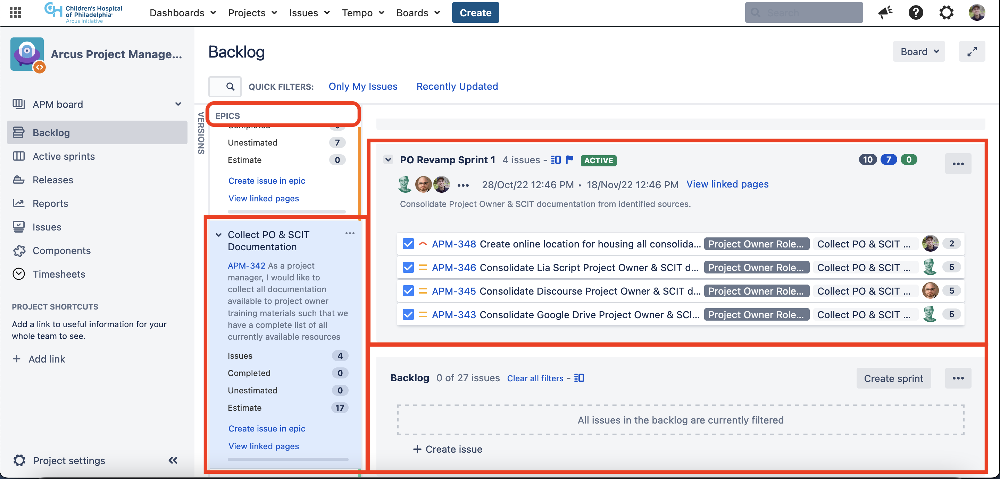

 

The screenshot above demonstrates an example use-case of managing a Jira epic for a project to revamp the project owner role within scientific projects. Within the *Epic* menu on the left-hand side, the epic "Collect PO & SCIT Documentation" is selected. The epic has a issue number ([APM-342](https://pm.arcus.chop.edu/browse/APM-342)) which has its own description (in this case, in the form of a user story – more information can be found in the *User Stories* section of this course). Issues pertaining to this epic within the sprint an the backlog are shown; in this case, all of the current tasks contributing to the epic are either completed or in-progress within the current sprint. Epics can be closed either by using the menu button to the right of the epic name within the epic side-menu, or by navigating to the epic issue and progressing the status to done.

#### Tasks

A **task** is a Jira issue type that describes work which needs completion to make progress on a project. Tasks are generally used to record and process all details involved in assigning, estimating, executing, reviewing, and releasing work. Consider the picture below demonstrating a task in the APM project:

 

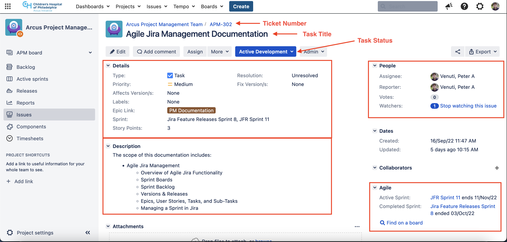

 

This issue ([APM-302](https://pm.arcus.chop.edu/browse/APM-302)) was created to track work for creating agile Jira management documentation. The issue number, task title, and task status can be found at the top of the task view screen. The *People* section to the right-hand side includes the assigned team member to the task, the reporter (typically a scrum master or a task stakeholder monitoring the ticket's progress) and all ticket Watchers (users subscribed to ticket update email notifications). Below the *People* section is the *Agile* section which provides some helpful information regarding the issue's sprint relationship(s). The *Details* contain data fields that should be revised where necessary, including the priority, fix version(s), epic link, and story points (the estimate of task complexity and time needed to complete the task). Finally, the *Description* is a long text box that should contain any important details on the execution and a definition of done.

#### User Stories

A **user story** is a Jira issue type that is driven by user needs. Note that a user need not be a customer or end-user of the product; a user could be a manager or team member that recognizes a need related to the project effort. User stories are typically named in the following fashion:

 

>As a **[user persona]**, I would like **[request]** such that **[desired impact]**

 

The format above is meant to provide clarity around the user requesting the work, the change which the user would like to see, and the desired impact which the user feels the change will solve. Consider an example in which Team A decides adding an automated form to their Jira issues would be beneficial to optimizing their workflow. If they were to submit a user story into their Jira project, their request should appear as:

 

>As a member of Team A, I would like to implement an automated issue form such that critical information is effortlessly centralized for all Team A members

 

Refinement of user stories should include an assessment of the task which the requesting party is looking to accomplish. The primary objective of user stories is to inform development team of users desires, values, and workflows such that they can design, build, and implement new features informed by user needs. This insight should be used to dictate a strategic approach for implementing a solution to the user story and to define under which conditions the request will be considered fulfilled. An example of a user story ticket is provided in the screenshot below ([APM-330](https://pm.arcus.chop.edu/browse/APM-330)):

 

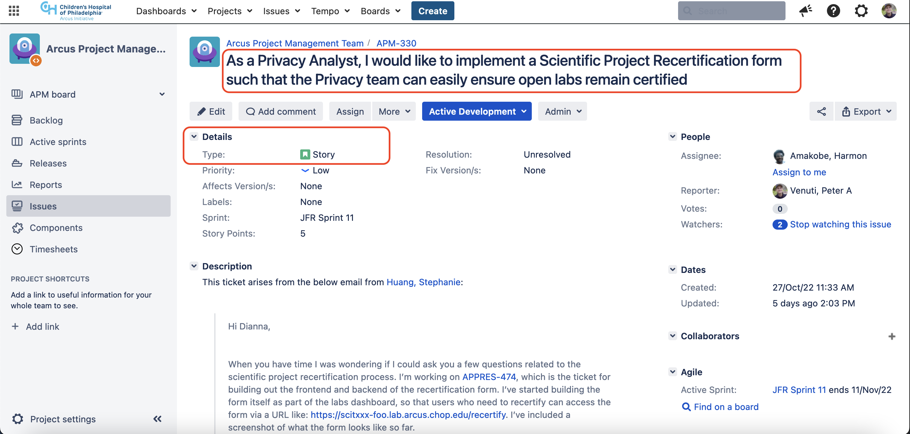

 

A task is similar to a user story in that both issue types may be allocated to a singular sprint and assigned a team member for execution. Additionally, both a task and a user story can evolve into an epic if it is agreed during task refinement that the effort at hand is larger than initially anticipated. **However, note that User Stories are different than Tasks in their purpose and categorization of work.** User stories are intended to distinguish user-driven tasks with a specific and informed approach to requirements gathering and discovery of required effort. On the other hand, tasks are typically project-driven (derived from a project plan or outline), but can also be user-driven if a user story evolves into an epic. A user story can act as a task with one or multiple sub-tasks, but a task cannot represent a user story on its own.

#### Sub-Tasks

 

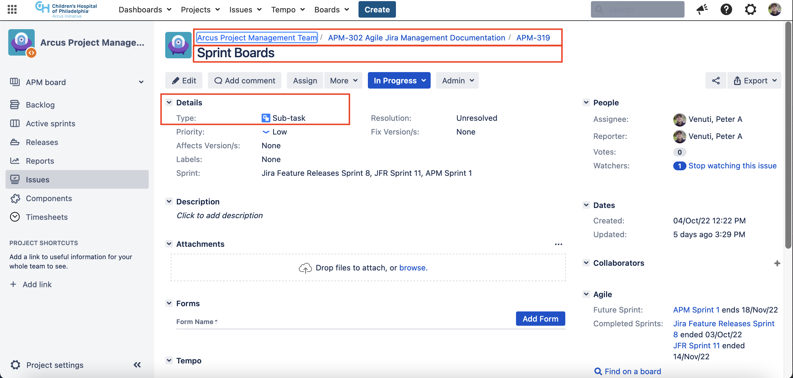

 

A sub-task is a Jira issue type which describes the lowest-level of work needed to complete an effort, and is typically linked to a parent task or user story. In Agile Jira Management, sub-tasks are typically reserved to the purview of the assignee of a task or user story. Sub-tasks will not appear in the sprint backlog or the project backlog, but will appear as a linked ticket on its parent ticket and will also be visible on the project's configured sprint board (assuming the sub-task has been linked to a task or user story within the sprint backlog). Sub-tasks are an excellent tool for breaking-up work within a larger task, and can be helpful for more detailed status tracking, defining the finished state, and estimating the work at hand. Sub-tasks should always be linked to a user story or task, as they represent the most detailed level of a larger effort. An example sub-task is demonstrated in the screenshot above ([APM-319](https://pm.arcus.chop.edu/browse/APM-319)):

### Linking an Issue to a Version (or Epic)

Once a version is configured and issues are being created, it will be useful to link issues to their appropriate version. Linking the issue will provide helpful insights into the version, as previously demonstrated in this article. The screenshot below demonstrates one way to link tickets to epics and versions from the backlog:

 

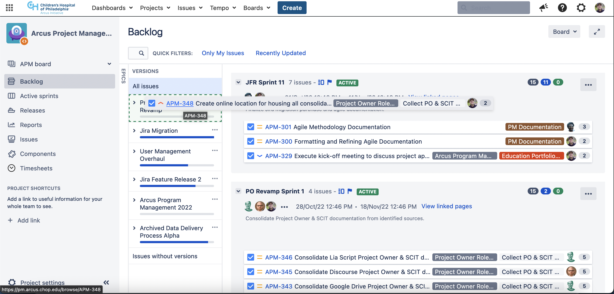

 

Linking a Jira issue to a version can be done in a few ways; when viewing the *Backlog* screen (as in the screenshot above), ensure you have the *Versions* side-menu expanded. Then you can click and drag a issue onto the desired version and release; doing this will associate the issue with the target release. You can also edit the *Fix Version(s)* field on any Jira issue supporting the Versions feature to associate it with a version.

### Knowledge Check

Test your knowledge on Agile Functionality in Jira by taking the below quiz.

Responses are only recorded for improving the quality of the training material; there is no grading or point requirements for successful completion of this course. Take quiz as many times as you feel would be beneficial for you.

 

<iframe width="640px" height="550px" src="https://forms.office.com/Pages/ResponsePage.aspx?id=FiQRprAHpUGbsdFGtXXJdZk76sp1AUtCuj5UbG5eYcxURExYNTBDUFk4RURLMEE2S0NGQ1RCSzFEUCQlQCN0PWcu&embed=true" frameborder="0" marginwidth="0" marginheight="0" style="border: none; max-width:100%; max-height:100vh" allowfullscreen webkitallowfullscreen mozallowfullscreen msallowfullscreen> </iframe>

## Managing a Sprint in Jira

Using the knowledge of how Jira enables agile functionality, it is possible to create, manage, and release development sprints within its environment. The next section of this guide will cover how to plan and start a sprint within Jira, tools used to refine and monitor the sprint, and finally how to release a sprint in Jira.

### Sprint & Project Backlog

Once versions have been configured appropriately, your team will want to create, maintain, and continually refine your project backlog to ensure it accurately reflects the related effort. A **project backlog** is a list of outstanding issues that will need to be completed to progress the project (also sometimes referred to as the product backlog). Navigating to the project backlog can be done by using the the project menu on the left-hand side of the Jira page and selecting the *Backlog* button (inside the green box in the screenshot below).

 

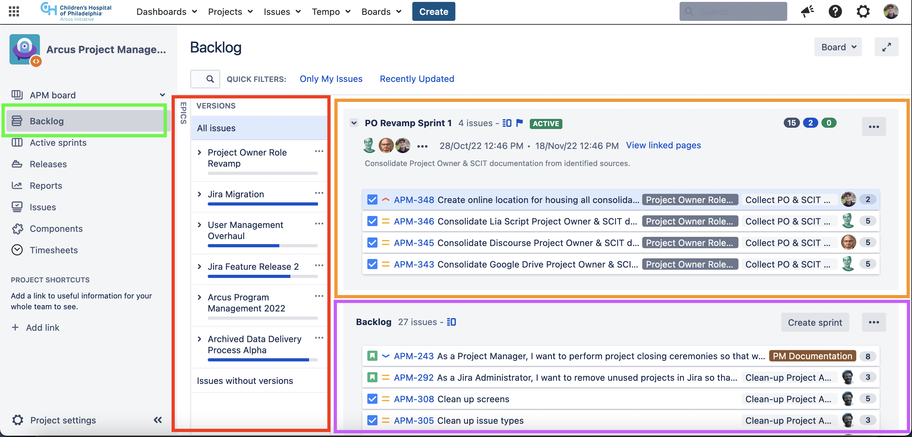

 

The project and sprint backlogs provide some basic organization features for managing a project; the *Epics* and *Versions* side-menus (inside the red box) allow the user to collapse and expand filters for respective groups of tasks (more on Epics later). The top of the page (inside the orange box) will display any active or saved development sprints (referred to as the sprint backlog) and the bottom of the page (inside the purple box) will display all issues in the project backlog and which are not assigned to a current or saved sprint. A sprint backlog will always be organizationally contained within the project backlog, but the sprint backlog will only reflect issues allocated to the current or planned sprint.

Note that if issues appear to be missing, an Epic or version filter may be active, hiding some results. You can clear Version and Epic queues by opening their side-menus and ensuring the *All issues* options are selected.

### Creating & Starting a Sprint

 

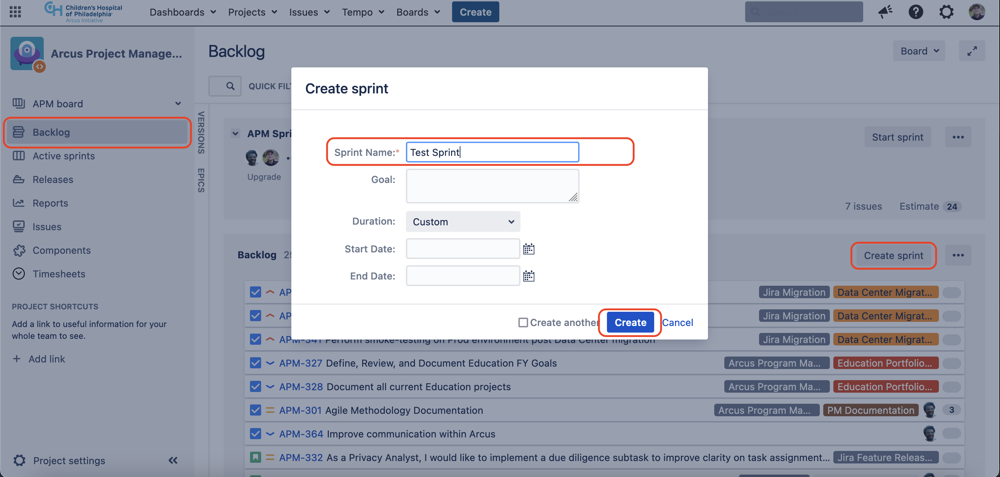

 

To create a new sprint from scratch, navigate to the project backlog and press the *Create Sprint* button on the upper-right-hand side of the *Backlog* container (pictured above). Jira will present a prompt requesting some basic information for the sprint you wish to create, however these details will not be required to begin scheduling the sprint and can be completed once the sprint is already configured (if you already know what the goal and start/end dates will be, you can populate them now). Provide the sprint with a descriptive name and press the *Create* button. Jira will then create a sprint container with the name provided, and now issues can be moved into the sprint backlog by dragging the issues into the sprint.

 

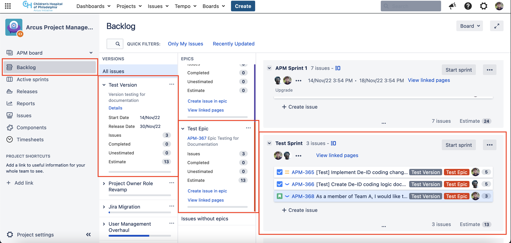

 

When staging an issue for a sprint, it is critical to ensure the task is refined enough such that relevant team members understand the scope of work, the relationship the issue has to higher-level goals, and final acceptance criteria. Each task should also be estimated in terms of the amount of effort and complexity involved in completing the task to assist with scope and resource management (for more help with estimating, see the APM Agile Methodology course). While refinement, definition, and estimation may be done through backlog refinement or sprint planning, it is a best-practice to ensure that each ticket within the scope of the sprint has been refined, categorized into higher-level priorities, estimated, and assigned to a resource. In the screenshot above, a sprint titled **"Test Sprint"** was created to demonstrate a successfully staged sprint. Notice that there are 3 tasks within Test Sprint, each of which is defined as relating to the release **"Test Version"** and to the epic **"Test Epic"**.

 

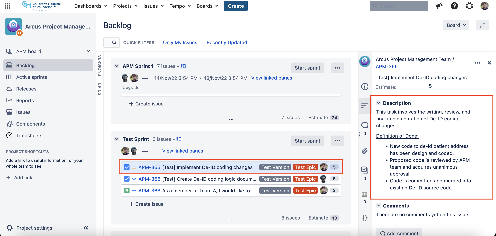

 

The screenshot above further demonstrates the concept of fully refining a ticket for sprint scoping. The ticket highlighted above ([APM-365](https://pm.arcus.chop.edu/browse/APM-365)), for example, describes work to implement deidentification logic into a De-ID software that de-identifies a patient's address. In the ticket description, the objective of the task is defined, and final acceptance criteria are also documented. Notice the *Priority* field was also used on this ticket to assign a medium-level priority, indicating that this task is likely a higher priority than the other two tickets in the sprint ([APM-366](https://pm.arcus.chop.edu/browse/APM-366) and [APM-368](https://pm.arcus.chop.edu/browse/APM-368), which have a low-level priority assigned). Recall that the specific data fields used by any one team may differ between Jira projects, however, all teams should utilize the *Estimation*, *Assignee*, and *Description* fields to improve expectation management and output quality.

When the sprint has been populated with refined tickets, it is time to finish configuring the sprint so it can begin. If the *Goal*, *Duration*, and *Start/End Dates* have not been already populated, this should be done now. While the APM Agile Methodology documentation goes into further depth in sprint duration and defining sprint goals, it is important to note the role of the sprint goal in relation to sprint execution. The sprint goals will define in plain language the value that will be added to or created with the conclusion of the sprint, assuming all tasks are completed as planned. The screenshot below demonstrates sprint goals for the Test Sprint in this ongoing example. When all fields have been completed, press the *Start* button. Congratulations! Your sprint is now in progress, and your team can begin working on tasks within the sprint!

 

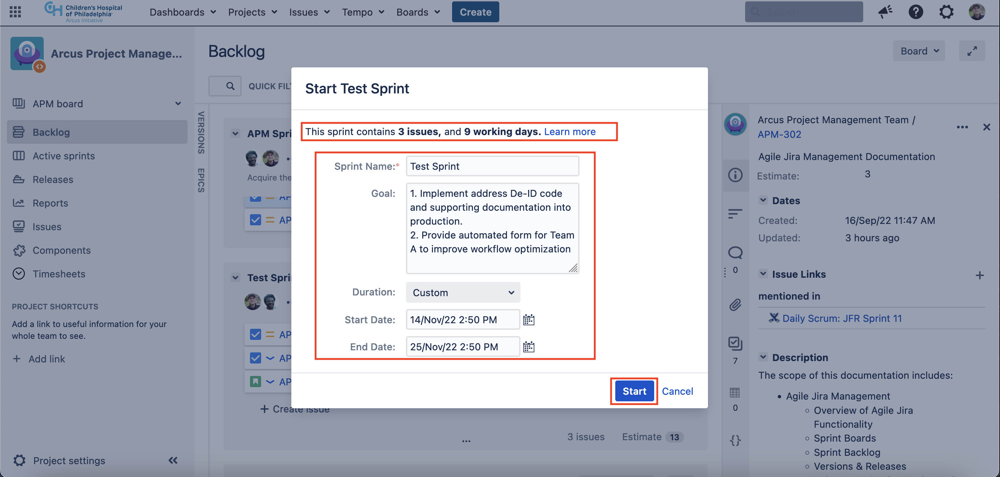

 

Note that articles created and managed within Confluence can be linked to the sprint from the *Backlog* view by pressing the *View linked pages* link at the top of the sprint and then by pressing the *Link page* button in the pop-up window. This is particularly useful for linking daily scrum reports and retrospective reports to the sprint for easy access to scrum reports. The team should ensure they have access to or have created a section of Confluence to store their sprint documentation within. Each sprint should utilize a daily scrum and retrospective report, which can be created using the Daily Scrum and Retrospective templates respectively on Confluence. Once the report pages are created, simply type the name of the report in the search bar provided in the Link page pop-up window and select the matching result.

### Sprint Boards

The **sprint board** is a Jira tool that attempts to provide increased functionality and visual representation of active sprints and tasks. The sprint board can be used to quickly move issues through the workflow as updates develop. It is also an effective tool to utilize in daily scrum meetings to audit the issues in the sprint and visually be made aware of the sprint scope for ensuring quality and efficiency. Examine the screenshot provided below of the sprint board:

[Demonstrating the sprint board in Jira...](sprint_board.png)

Notice the title *Test Sprint* at the top of the page; this screenshot demonstrates that the board is filtered specifically on tasks categorized within that sprint. To see all tasks and sprints within a projecxt, click on the *Switch sprint* link next to the title of the sprint and ensure *All sprints* is selected. The sprint goal(s) provided during sprint configuration will appear below the sprint name. Other filters can also be applied to the sprint board such as a filter on personally owned issues and/or recently updated issues.

Below the filter is the primary board space; the board is split into columns referred to as **swim lanes**, which categorize tickets based on status values. Most sprint boards flow from left to right, with the earliest possible status is the left-most lane, and sequential issues statuses populating neighboring lanes to the right. Team members can update issue statuses from the sprint board simply by clicking and holding on the targeted issue and moving it into another status swim lane. Note that some workflow restrictions may apply depending on the workflow defined by the Jira project (for example, within the APM project, the *In Review* status can only be moved to *Development Complete* by the assignee of the task in review). Additionally, notice that each team member assigned to tasks in the sprint are separated into their own rows to clarify which tasks are assigned to team members within the sprint.

### Closing a Sprint

The final day of the sprint will be the release date, which is when the development team should create time to meet and review the tasks as well as release all finished tasks in the sprint. Releases are most effectively performed using the sprint board, as it is a solid centralized location to perform actions such as applying last-minute updates to issues where needed. The visual format of the sprint board also tends to lend itself to productive release meetings, as assignees can take turns reviewing the tasks in their purview (please see the APM Agile Methodology documentation for more details on performing a release). Once all issues have been reviewed, and the team is ready to complete the sprint, click the *Complete* sprint button on the top-right side of the sprint board screen. The screenshot below provides a demonstration of what completing a sprint will look like:

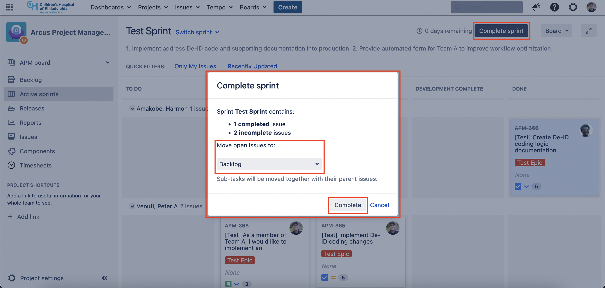

In the screenshot above, notice how APM-366 is the only ticket that was completed within the sprint; APM-368 is still in Active Development, while APM-365 is still In Review. Assuming these statuses are accurate, the issues will need to be moved back into the backlog so they can be completed in a following sprint. Note that you can customize the destination where the remaining tickets are moved by selecting the drop down menu highlighted in the screenshot above. For example, if your team is aware of tasks that will not be complete and plans to inherit those tasks as technical debt into the next sprint, you can target the next sprint in the drop down menu and automatically move the remaining issues into the next sprint. Be sure that you have already created the next sprint before attempting to move remaining tasks into the upcoming sprint.

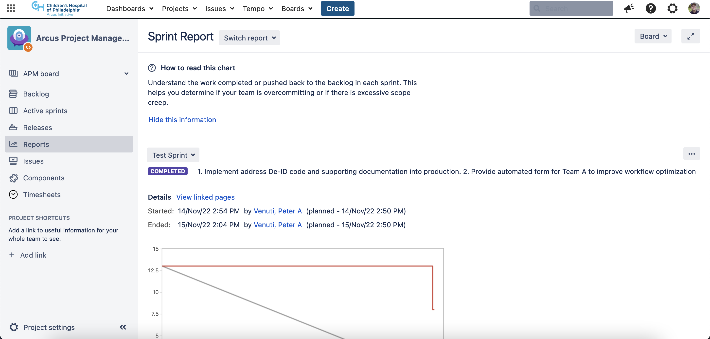

When a sprint has been successfully completed, the page will redirect to the Sprint Report page (pictured above). This section allows you to visualize in-depth details and statistics of your sprint, which can be used to inform strategy and refinement of future sprints. Assuming scrum and/or retrospective reports were also linked, those reports will always be visible through the sprint report associated with the arbitrary sprint. The sprint report can display other past sprints by selecting the *Switch report* button at the top of the screen next to the *Sprint Report* title.

### Knowledge Check

Test your knowledge on Agile Sprint Management in Jira by taking the below quiz.

Responses are only recorded for improving the quality of the training material; there is no grading or point requirements for successful completion of this course. Take quiz as many times as you feel would be beneficial for you.

 
<iframe width="640px" height="550px" src="https://forms.office.com/Pages/ResponsePage.aspx?id=FiQRprAHpUGbsdFGtXXJdZk76sp1AUtCuj5UbG5eYcxUQlBCTVJGTFBXOVgzNkRNRUZYMzVSODdRUCQlQCN0PWcu&embed=true" frameborder="0" marginwidth="0" marginheight="0" style="border: none; max-width:100%; max-height:100vh" allowfullscreen webkitallowfullscreen mozallowfullscreen msallowfullscreen> </iframe> 

## Conclusion

Congratulations! This completes the Agile Jira Management training course! On behalf of the APM team, we hope this course was helpful for learning more about Agile methodology, Jira, and managing sprints.

Please continue to the Attestation & Feedback sections of this course before navigating away from this page!

The attestation section contains a form which can be used to attest to completion of this course. Use the Teams survey provided to attest and obtain a receipt of course completion.

The feedback section contains a survey which the APM team uses to iteratively improve the quality of our training. Please take a moment to complete the feedback survey; all responses are anonymous!

### Attestation

<iframe width="640px" height="550px" src="https://forms.office.com/Pages/ResponsePage.aspx?id=FiQRprAHpUGbsdFGtXXJdZk76sp1AUtCuj5UbG5eYcxUOVE2RzVHTjBNWUpYNzZJMVM1MkpORVRTUiQlQCN0PWcu&embed=true" frameborder="0" marginwidth="0" marginheight="0" style="border: none; max-width:100%; max-height:100vh" allowfullscreen webkitallowfullscreen mozallowfullscreen msallowfullscreen> </iframe>

### Course Feedback

<iframe width="640px" height="550px" src="https://forms.office.com/Pages/ResponsePage.aspx?id=FiQRprAHpUGbsdFGtXXJdZk76sp1AUtCuj5UbG5eYcxUMEI0OU9HNUFPNElXSFJZVDZKUFBIUjNTUiQlQCN0PWcu&embed=true" frameborder="0" marginwidth="0" marginheight="0" style="border: none; max-width:100%; max-height:100vh" allowfullscreen webkitallowfullscreen mozallowfullscreen msallowfullscreen> </iframe>

