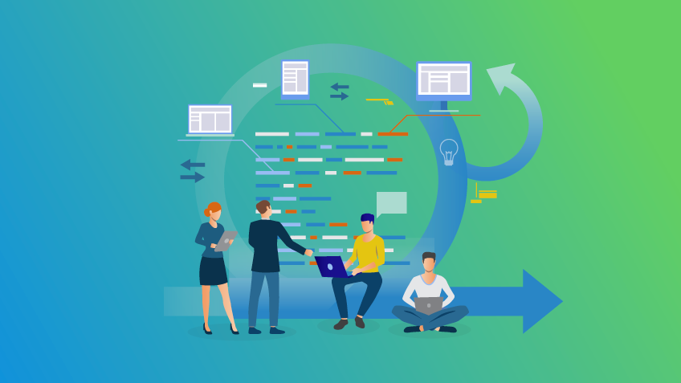
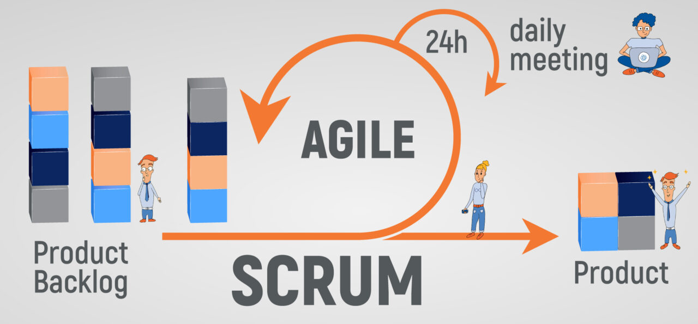
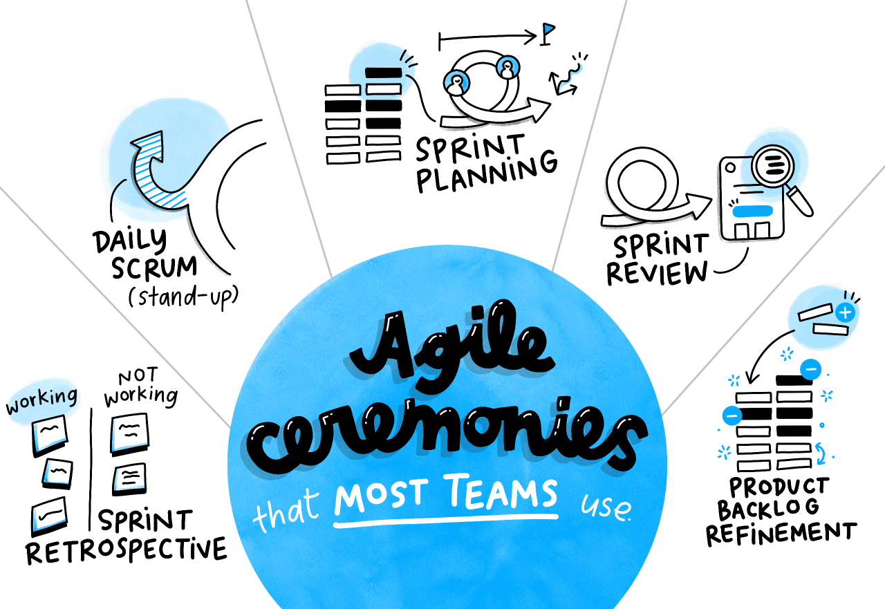
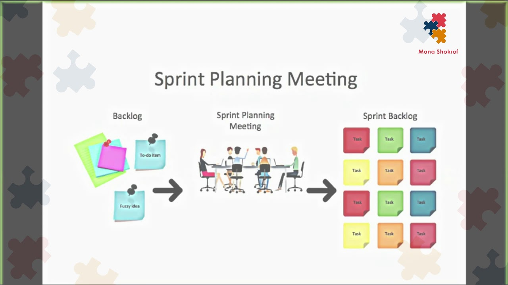
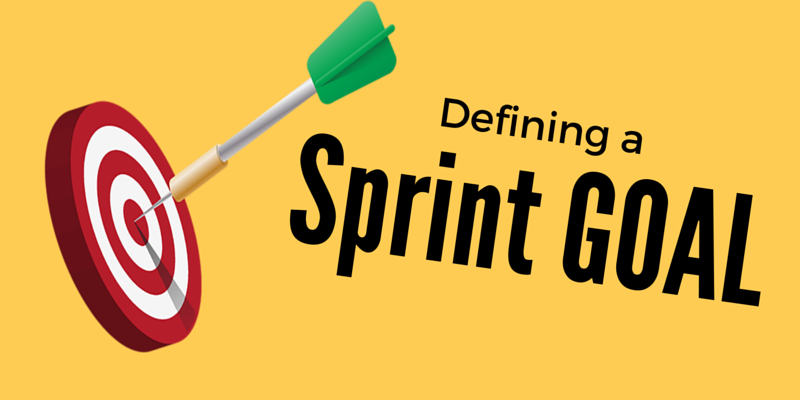
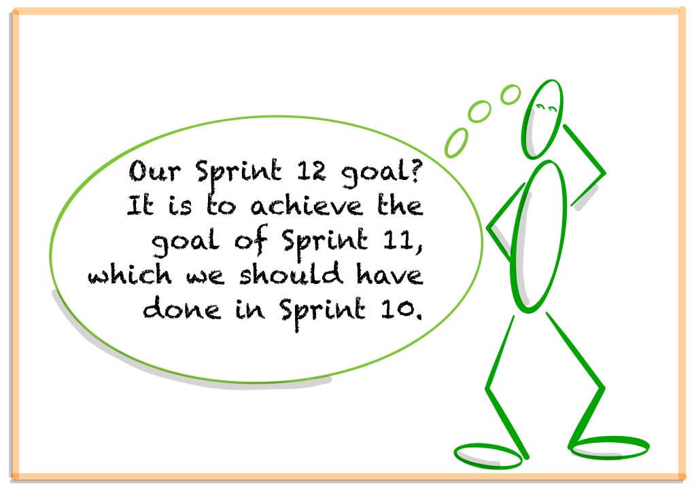
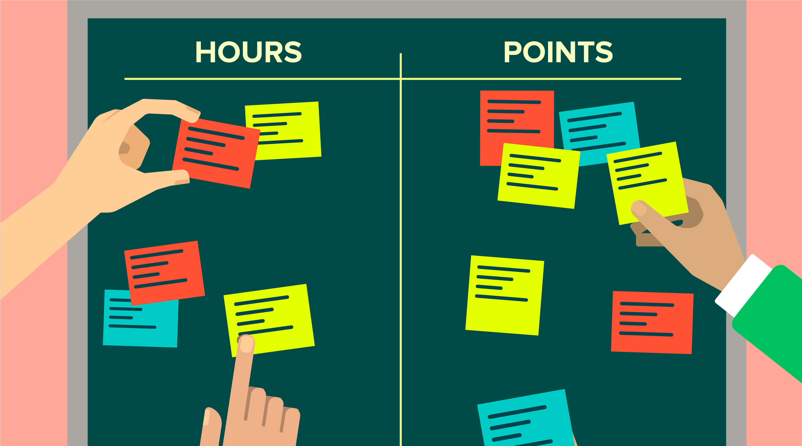

# Agile & Scrum Methodology Course

Welcome to the Arcus Project Management training course on Agile and Scrum Methodology! This course was designed as an entry-level guide for managing and executing projects using an Agile implementation approach paired with Scrum methodology. This article assumes that you are familiar with high-level best-practices of project management and the project life cycle , and is focusesed on how to properly employ Agile and Scrum execution. For more information specifically on Agile Jira Management, visit APM's [Agile Jira Management](https://wiki.chop.edu/display/ARCUS/Agile+Methodology+Overview) course.

## Terms & Acronyms

The following table provides a comprenhensive list of terms which should be useful for reference throughout this course:

 

| Term | Description |
|:-|-|
|**Agile**|A project management & execution philosophy which emphasizes value on predicatable, frequent, and recurring collaboration with stakeholders via rapid and cyclical development iterations. This philosophy operates under the premise that a project can continuously be refined throughout its life cycle through consistent execution and communication in cycles referred to as Sprints.|
|**APM**|Arcus Project Management – The core Arcus team providing project management and organizational support, both internally for Arcus initiatives and externally for scientific research projects.|
|**Execution Methodology**|The chosen process for facilitating project execution (i.e: Agile/Scrum, Waterfall/Traditional Project Lifecycle, Hybrid).|
|**Jira**|A web-based management platform (used by Arcus) designed for organizing, tracking, and planning organizational initiatives down to the task/sub-task level.|
|**Jira Service Desk**|An additional Jira product (used by Arcus) which adds a web-based service portal to the Jira environment. The service portal enables both Arcus contribituors and Arcus users to submit service requests to the Support Desk.|
|**Product Roadmap**|A project's high-level execution plan over a period of time (typically in months, quarters, or years). Detailed project planning is outside the scope of traditional project roadmaps. Example product roadmap milestone: "By March, platform A will be upgraded from version B to version C.")|
|**Scrum**|An Agile methodology for delivering a product to customers. Scrum is regarded as one of the most succesful and popular Agile frameworks.|
|**Sprint**|A timeframe within which an execution team commits to executing a set of tasks required to progress one or more projects. Traditional sprints are 2 weeks in length (10 business days), where Day 1 is devoted to planning and Day 10 is devoted to release and reflection. The remaining 8 days between are devoted to task execution and checkin via the daily scrum).|
|**Sprint Goal(s)**|A brief explanation of what the team plans to achieve during the course of the sprint.|
|**Sprint Backlog**|A collection of tasks queued for execution in the current sprint. Every task in the sprint backlog should include a documented summary, scope, definition of completion, and estimatation.|
|**Waterfall**|A project management & execution philosphy which emphasizes value on clearly defined phases, boundaries, approvals, and dependencies to progress a project. This philosophy operates under the premise that a project's lifecycle should be strictly defined, documented, and approved by participating parties. Waterfall implementations typically operate under a binary sequential workflow, with scope changes often requiring a significant degree of lifecycle regression.|

## Agile and Scrum Overview

**Agile** is a development philosophy involing a rapid, cyclical, and iterative development process to provide stakeholders with valuable products, services, or features. Agile is somewhat new compared traditional philosophies such as Waterfall, and is especially unique in its values on frequent user and stakeholder engagement. Agile projects typically maintain a high-level strategic implementation plan, similar to other methodologies (sometimes referred to as a **product roadmap**). However, in Agile environments, there is less emphasis on constructing detailed project plans (which are generally regarded as counter-productive to the Agile's values). User stories and requests will inform the scope of upcoming iterations, where the backglog of user requests will drive the direction of the product.

So, what is **Scrum**, and how is it different from Agile? Whereas Agile is a philosphy, Scrum is the methodology enacting the philosophy, and serves as the vehicle for executing projects in an Agile fashion. One of the most powerful synergies of Agile and Scrum is the use of regular, consistent, and small development iterations. A **sprint** (also called an iteration) is a timeframe within which the development team commits to executing a set of tasks, resulting in value being delivered to stakeholders. The complete set of tasks which make up the sprint scope is reffered to as the **sprint backlog**, where each task is assigned, owned, and executed by a developer. Traditional sprints run for 2 business weeks (10 business days), where the first day in the sprint is devoted to planning and kickoff ceremonies, and the final day of the sprint is devoted to release and retrospective ceremonies.

The first modules of this course provide further guidance on proper execution of Agile and Scrum execution. The final modules explore Sprint & Scrum in comparisson to other methodologies (because no methodology is the best in all situations!).

## Scrum Ceremonies

Agile & Scrum methodology is heavily supported by a reccurring ciriculum of purposeful ceremonies:

- The **Sprint Planning** ceremony is the first of the sprint in which the development team, the **scrum master**, and the product manager aim to agree to one or more Sprint Goal(s) and determine the sprint scope.
- **Daily Scrum** occurs every day between the start and end of a sprint, and in which the scrum master facilitates a rapid touch-point for the team to communicate updates and complications.
- **Release & Retrsospective**, which concludes the sprint with a release of the completed tasks, mitigation planning for unfinished tasks if required, and reflection on actions that could be taken to improve the next sprint, based on the ending one.

Standard Scrum implementations assigns ceremony facilitation responsibilities to a role called the scrum master. Scrum itself does not recognize the traditional project manager role; however, project managers can be trained to perfom these responsibilities as an acting scrum master. An Arcus project manager will act as the scrum master in most instances.

The modules contained in this section provide further guidance and helpful information for proper ceremony execution.

### Sprint Planning

The Sprint Planning ceremony is the first ceremony in the Agile-Scrum cycle. It has several roles and functions, but at its highest level, the result of this ceremony should provide all parities with a shared understanding of the sprint's goal(s), the tasks to be executed in the sprint, and the value that will be released to stakeholders at the sprint's conclusion. This level of expectation management is critical to the success of Agile implementations, as stakeholder engagement, feedback, and needs will have a heavy impact on product acceptance and higher-level direction.

Specifically, the Sprint Planning ceremony aims to accomplish the following goals:

- Align developers, the scrum master, and the product owner on the sprint goal(s)
- Create the Sprint backlog via migration of tasks from the product backlog needed to accomplish the sprint goal
- Refine and accept scope of work for all tasks in the sprint backlog, including:

  - Summary & Description (What is this task? What must be done?)
  - Definition of Done (X must be delivered in Y fashion to consider the task finished)
  - Relevant epics & releases linked (via Jira)
  - Work effort estimation in story points (Complexity x Scope)

The recommended length of a Sprint Planning ceremony is 1 – 2 hours, however, some teams may require more or less time depending on their circumstances. A minimum of 1 hour is recommended for thorough verification that each of the above items has been appropriately defined, documented, and understood. Sprint Planning ceremonies are traditionally led by the scrum master, in which they will visualize the product and sprint backlogs for the team and facilitate backlog creation and task refinement.

In Arcus projects, this is typically conducted using the Backlog screen of the appropriate Jira project (for more information regarding Jira, see the [Creating & Starting a Sprint](https://liascript.github.io/course/?https://raw.githubusercontent.com/arcus/apm-public/main/agile_jira_management/agile_jira_management.md#14) module in the Agile Jira Management course)

#### Sprint Goals

Sprint Planning starts with defining the **Sprint Goal**, which is a brief description of the objectives and value brought to stakeholders by its conclusion. The Sprint Goal is determined by the team through review of the **product backlog**, and describes the scope negotiation between the project manager and the development team. For these reasons, the defined Sprint Goals should be specific and measurable. The Sprint Backlog can then be populated with tasks which the development team committs to executing by the end of the sprint. Note that the tasks in the Sprint Backlog will represent a forecast of the items to be executed by the sprint release.

The list of measures below can be used to assess the quality of a determined Sprint Goal:

- The goal(s) describes how value will be brought to the live product (ex: test a design, address a risk, or deliver a feature).
- The goal(s) ensures a focused Daily Scrum such that the development team can effectively use it to measure progress.
- The goal(s) provides guidance to the development team on why it is building the Sprint.
- The goal(s) offers functionality implementation flexibility (no strict dependencies on other elements, i.e. related but uncompleted work).
- The goal(s) assists with setting priorities when issues emerge.
- The goal(s) fosters cooperation, communication, and teamwork by providing a common goal.
- The goal(s) supports the project manager in creating a **product roadmap** (the high-level plan for the project spanning several sprints).
- The goal(s) stimulates Product Backlog cohesion when planning a release.
- The goal(s) could be shared with relevant stakeholders for expectation and customer management.
- The goal(s) supports focused Sprint Planning.
- The goal(s) measurably supports efficient decision-making

It is critical for the project manager to prevent vague Sprint Goals to keep the team's sprint backlog healthy, appropriate, and accurate to what needs completion. Sprint Goals should be concise, but they do not need to be overly exhaustive. Some examples of solid Sprint Goals include:

- "Get feature X ready for release":
- "Check if the architecture enables the desired performance"
- "Test if users are willing to register before using the product features"

For additional support with formulating an appropriate sprint goal(s), consider the following three questions:

1. Why do we carry out the Sprint? Why is it worthwhile to run a sprint? What should be achieved?
2. How do we reach its goal? Which artefact, validation technique, and test group are used?
3. How do we know the goal has been met? For instance at least three of the five users carry out the usability test successfully in less than a minute

#### Task Refinement

Once the team has defined the Sprint Goal, the scrum master can begin facilitating sprint backlog creation with the team by migrating tasks from the product backlog. The scrum master, the development team, and the product owner will collaboratively determine which tasks from the product backlog align with or are required to meet the the Sprint Goal. The complete sprint backlog reflects the team's commitment to executing each task by the end of the sprint. As such, the sprint backlog is a critical instrument for managing stakeholder expectations.

Refining tasks to include sufficiently detailed requirements and acceptance criteria reduces the risk of delivering mis-aligned value to stakeholder expectations. Consider a scenario in which you have been assigned the following task:

> **Summary:** Create documentation for Agile functionalities in Jira **Description:** Create a document describing relevant Agile functionalities in Jira. **Definiton of Done:** Documentation is available regarding the Agile functionalities supported by Jira.

Would you feel confident executing this task and delivering documentation that meets everyone's expectations? If you answered yes, consider some of the following questions: Where will the documentation be hosted? What Agile functionalities are and are not within scope, and how will the document be designed? Will this document be written as an article, a memo, or a training course? Is any research of Agile functionalities in Jira required, or do you know them all already? To this end, task refinement helps to eliminate intrepretive uncertaines such as these through crtical design requirements definition and alignment. Task refinement, however, should not be conflated with simply adding information or detail to a task.

Consider the task exists within a team where documentation is **always** hosted in Google Drive, and in which **only** PowerPoint files are used for documentation. In this example, it could be argued that documenting this level of detail is unnecessary because the team is already passively aligned on these attributes. The level of detail required will be influenced by several factors such as team culture, process standardization, and the nature of each task. As a general rule for determining whether additional details are required, Agile and Scrum place highest value on rapid, iterative problem solving. So long as stakeholders feel value is ultimately being added as a result of execution, the product can always be refined and further developed to better match stakeholder expectations.

Here's an example of how the example task above could be further refined 

> **Summary:** Design and develop user login portal **Description:** This task involves designing, coding, and implementing a webpage page into the Arcus site which enables users to login to website. The

It is the responsibility of the scrum master to guide the team in deliniating what constitues enough detail.

#### Task Estimation

The best approach to start with relative estimation is to try some examples on real-life objects. Try to compare a phone to a laptop and LCD. Use the following scenario:

1. Put all the stories (objects) in front of developers.
2. Let them choose one story (object) that will get the number Effort=1. Typically it is a small story like „I as a user want to save a file to disk“.
3. Then compare all remaining stories relatively to a referenced story and other, already estimated stories.
4. For example, Story 2 – "I as a user want to calculate average values per year for every customer“ is a more complex story than Story 1 mentioned above. As a developer, I think that this story is 3 times harder than Story 1. Therefore  I will set Effort = 3 story points.

You will do this for every story in your product backlog. This estimation is done by developers and testers. The team sits together in a meeting room with the product owner and talking about stories, what he wants and needs. The product owner will say us as much as he can. We will ask him from a technology point of view. Some stories are changed during the discussion, some new stories can appear as well.

The product is typically estimated in 1-3 full days during the planning meeting.  All your developers and testers known what the product owner wants. The product owner meets with the development team. He sees developers hence closer relations can be built.

The size of stories is estimated in the Fibonacci scale. Scale is 0,0.5, 1,2,3, 5, 8, 13, 20,40,100.

If the story is bigger than the agreed limit (8, 13, or more) then it should be split into smaller stories. It is too complex to be developed.

Taken from: [Effort = complexity = Story points](https://www.scrumdesk.com/effort-vs-time/)

### Daily Scrum

_The Daily Scrum is a 15-minute time-boxed event for the Development Team. The Daily Scrum is held every day of the Sprint. At it, the Development Team plans work for the next 24 hours. This optimizes team collaboration and performance by inspecting the work since the last Daily Scrum and forecasting upcoming Sprint work. The Daily Scrum is held at the same time and place each day to reduce complexity._

##What did I do yesterday that helped the Development Team meet the Sprint Goal?

##What will I do today to help the Development Team meet the Sprint Goal?

##Do I see any impediment that prevents me or the Development Team from meeting the Sprint Goal?

### Release & Retrospective

The purpose of the Sprint Retrospective is to:

- Inspect how the last Sprint went with regards to people, relationships, process, and tools;
- Identify and order the major items that went well and potential improvements; and,
- Create a plan for implementing improvements to the way the Scrum Team does its work.

What went well in the Sprint?

What could be improved?

What will we commit to improve in the next Sprint?

### Knowledge Check

Test your knowledge on Agile by taking the below quiz.

Responses are only recorded for improving the quality of the training material; there is no grading or point requirements for successful completion of this course. Take quiz as many times as you feel would be beneficial for you.

 

<iframe width="640px" height="550px" src="https://forms.office.com/Pages/ResponsePage.aspx?id=FiQRprAHpUGbsdFGtXXJdZk76sp1AUtCuj5UbG5eYcxUNlAzWDI0R1RFOEZITEhMS0MxNzJYUENUQSQlQCN0PWcu&embed=true" frameborder="0" marginwidth="0" marginheight="0" style="border: none; max-width:100%; max-height:100vh" allowfullscreen webkitallowfullscreen mozallowfullscreen msallowfullscreen> </iframe>

## Methodologies Comparission

**Execution methodology** refers to the process by which a team will execute a project. Deciding which methodology to use for a project will be a crticial factor in its success, and to that extent, the execution methodology should be clearly understood and consented to by both the execution team and relevant stakeholders. Remember: there is no one best methodlogy to use for every project. Each of the three most popular methodlogies have thier unique benefits and drawbacks.

The key to successfully choosing the best methodology for a specific project is to identify the methodology which appears to provide the most valuable benefits with the least impactful drawbacks. This should include consideration of the execution team's development style, the needs of stakeholders and customers, and basic project requirements (timeline, budget, specifications, etc.). The project manager handling the project is responsible for understanding the methodology options and for recommending the most appropriate methodology in the best interest of the project and its stakeholders. The final decision regarding the exeution methodology will typically fall to an authority above the project manager (ex: program manager, director, executive stakeholder, sometimes the customer).

There are generally 3 approaches to managing and executing a project:

- **Waterfall Methodology** relies on consistent use of strictly defined, documented, and measured project phases. Each project phase is seperated by an approval boundary measuring the project's requirement fitness to proceed. Approval is typically required from one or more relevant stakeholers to verify whether the phase objectives have been completed to the documented specifications. While Waterfall provides strong organizational support through strict process definition, Waterfall is also infamous for its struggle with handling rapidly evolving user needs. Consider a team using Waterfall to complete development on a sleep monitoring app; after development is complete, the app will enter quality assurance testing being deplpoyed to users.

   This team unexpectedly receives stakeholder feedback to change some of the app's core design features. However, the design for the app has already be approved, and in a traditional Waterfall implementation, this cannot be changed. Depending on the priority and impact of the requested changes, the team could go back to the Design phase, or aim finish the project and begin planning a new iteration to address the feedback. By the time the team could get to addressing the feedback, there is a high risk it could no longer be relevant to what users are requesting. Additionally, stakeholder & customer disatisfaction is likely due to the time needed to address design feedback, even if the development team has delivered on the agreements made.

- **Agile** relies on short, cyclical development iterations which are much more user-driven than other methodologies. The iterations, or sprints, are the primary vehicle for quickly providing a small batch of user-requested features on a consistent schedule. Agile values a short but iterative release loop paired with an emphasis on stakeholder intereation to deliver value to customers. The Agile does not value documentation, approval, or specific requirements as much as other methodologies such as Waterfall. However, the Agile does employ several support ceremonies which serve a similar purpose:
   
   - The *Sprint Planning* ceremony is a biweekly meeting with the development team, the project manager/scrum master, and the product owner. The purpose of this ceremony is to agree to the Sprint Goal(s), to set the scope of the Sprint Backlog, to assign tasks to team members, and to verify task details (estimations are correct, summary of the task and its purpose is provided, definition of done agreed upon, etc. – more on all these in later modules). 

- **Hybrid Methodology** relies

### Methodology Pros & Cons

The table below provides a summary of the pros and cons for each of the three methdologies as a recap of the last module. Feel welcome to reference this table when determining the appropriate approach for a project:

|**Methodology**|**Pros**|**Cons**|
|**Waterfall**|- Clearly defined & documented requirements - Clear start and finish - High accountability|- Rigid and sequential structure - Low adatapability - Process-focused|
|**Agile**|- Rapid adaptability - User-driven development - Increased stakeholder interactivity - Consistent release schedule - Baked-in retrospective analysis - People-focused|- Interactively demanding - Requires consistent stakeholder participation - Potentially challenging for long-term planning|
|**Hybrid**| - Adatapble to project needs - Compromise of two alternatives - Adjustable workload scheduling|- Implementation-dependent - Conflicting paradigms|

### Knowledge Check

Test your knowledge on the various execution methodologies by taking the below quiz.

Responses are only recorded for improving the quality of the training material; there is no grading or point requirements for successful completion of this course. Take quiz as many times as you feel would be beneficial for you.

 

<iframe width="640px" height="550px" src="https://forms.office.com/Pages/ResponsePage.aspx?id=FiQRprAHpUGbsdFGtXXJdZk76sp1AUtCuj5UbG5eYcxURExYNTBDUFk4RURLMEE2S0NGQ1RCSzFEUCQlQCN0PWcu&embed=true" frameborder="0" marginwidth="0" marginheight="0" style="border: none; max-width:100%; max-height:100vh" allowfullscreen webkitallowfullscreen mozallowfullscreen msallowfullscreen> </iframe>

## Conclusion

Congratulations! This completes the Agile training course! On behalf of the APM team, we hope this course was helpful for learning more about Agile, its strengths and weaknesses, and how it compares to other methodologies.

Please continue to the Attestation & Feedback sections of this course before navigating away from this page!

The attestation section contains a form which can be used to attest to completion of this course. Use the Teams survey provided to attest and obtain a receipt of course completion.

The feedback section contains a survey which the APM team uses to iteratively improve the quality of our training. Please take a moment to complete the feedback survey; all responses are anonymous!

### Attestation

<iframe width="640px" height="550px" src="https://forms.office.com/Pages/ResponsePage.aspx?id=FiQRprAHpUGbsdFGtXXJdZk76sp1AUtCuj5UbG5eYcxUQVM5WEZTWktTVDhaUUg5N1dCWkoxRVJCUSQlQCN0PWcu&embed=true" frameborder="0" marginwidth="0" marginheight="0" style="border: none; max-width:100%; max-height:100vh" allowfullscreen webkitallowfullscreen mozallowfullscreen msallowfullscreen> </iframe>

### Course Feedback

<iframe width="640px" height="550px" src="https://forms.office.com/Pages/ResponsePage.aspx?id=FiQRprAHpUGbsdFGtXXJdZk76sp1AUtCuj5UbG5eYcxUOFZXOUNDOTc2SzlJUDdKVFFIN1VBVktYUSQlQCN0PWcu&embed=true" frameborder="0" marginwidth="0" marginheight="0" style="border: none; max-width:100%; max-height:100vh" allowfullscreen webkitallowfullscreen mozallowfullscreen msallowfullscreen> </iframe>

## References

Overeem, B. (2016, March 6). *The 11 advantages of using a sprint goal*. Scrum.org. https://www.scrum.org/resources/blog/11-advantages-using-sprint-goal

Wrike. (n.d). *What is Agile in project management?*. https://www.wrike.com/project-management-guide/faq/what-is-agile-methodology-in-project-management/
